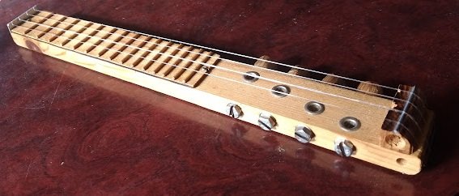
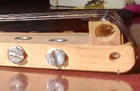
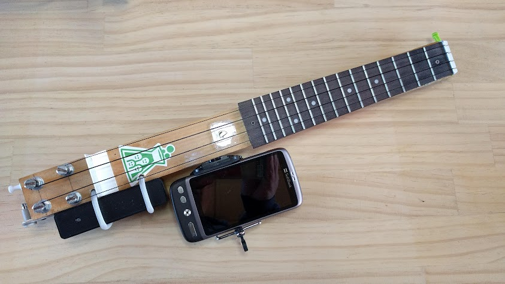

# めざせ世界最小ウクレレ

## レギュレーション
世界最小ウクレレを目指すうえで課した条件があります。スケール(弦長)とフレット位置とフレット数は標準のソプラノウクレレの寸法に準じます。これはウクレレの演奏経験のある方なら誰でも弾けるようにするためです。

## モチベーション
わたしは国内外の旅行はバックパックのみを背負って行きます。そのバックパックに収まるウクレレが欲しかったのですが、なかなか見つけることができませんでしたので、小さくてかさばらないウクレレを自作ることにしたのです。

## 仕様
~~~
長さ　14インチ (約36cm)
弦の長さ345mm（34.5cm）
フレット数　15フレット
~~~

## 機能と特徴
### 小さくする工夫
ウクレレの筐体で共鳴させる機能を排除して筐体の体積を小さくしました。
また弦をボディの裏に折り返してペグに巻くことでさらにウクレレの筐体を短くしています。

### 作りやすさ
本来楽器は音響的な性能が問われるので、経験と技能を持ち合わせた熟練工しか作ることが難しかったのですが、あえて音響的な機能は排除したので初心者でも容易に楽器を作製することができます。

### サイレントタイプ
現代の生活環境では、思いっきり楽器を演奏するためにはスタジオを借りるか、河べりに行って弾くしかなかったのですが、音響部分をなくしたおかげでサイレントモードでの演奏が可能になりました。周りを気にせず公の場、電車の中、あるいは隣が気になる集合住宅などでも演奏することが可能です。

### 音響結合(acoustic coupling)
もし一度に多くの人に演奏を聴いてもらいたい場合のひとつの手段として、音響結合があります。机や壁にウクレレの筐体を押しあてて演奏することで振動を共鳴させることでより大きな音を出すことが可能となります。

### スマホアプリとの連携
スマホアプリとの連携でウクレレの機能を拡張できます。

もうひとつの演奏音の増幅方法はスマホアプリと連携させることによりBluetooth経由でアンプに接続しより大きな音で演奏が可能となります。

https://play.google.com/store/apps/details?id=com.microphone.bbmic.lite&hl=ja&gl=US

またスマホアプリのチューナー等と連携するこで、チューニングを容易に行うことができます。

https://play.google.com/store/apps/details?id=hai.lior.ukaleletunerfree&hl=ja&gl=US

## 音楽は言葉を超える
小さなウクレレを携帯することで日本の旅先や海外でもたくさんの友人を作ることができました。

浅草

Seattle

Seoul

## other resources
## Movie
https://youtu.be/XsqKR72CPbo

